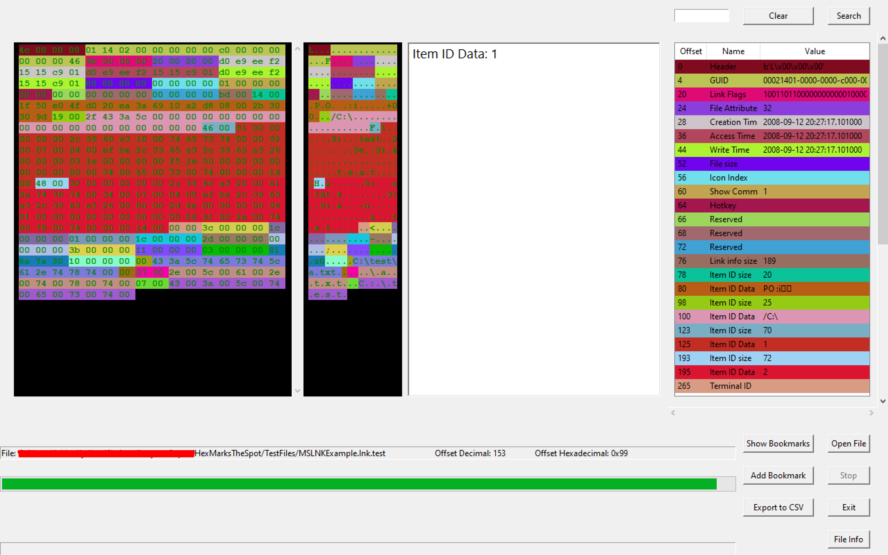
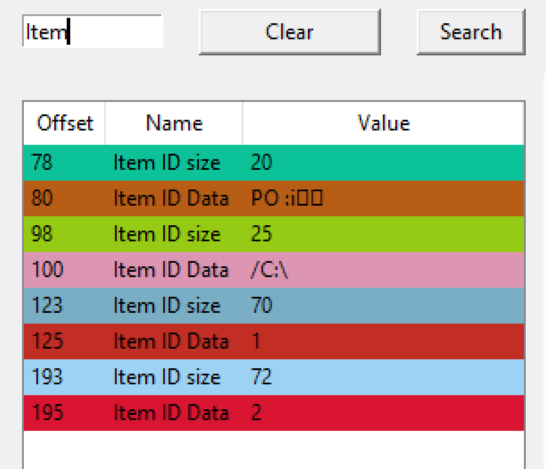
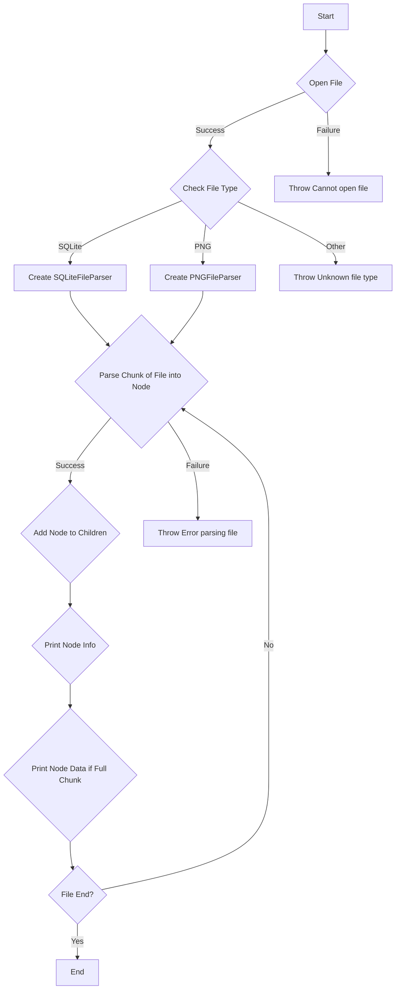
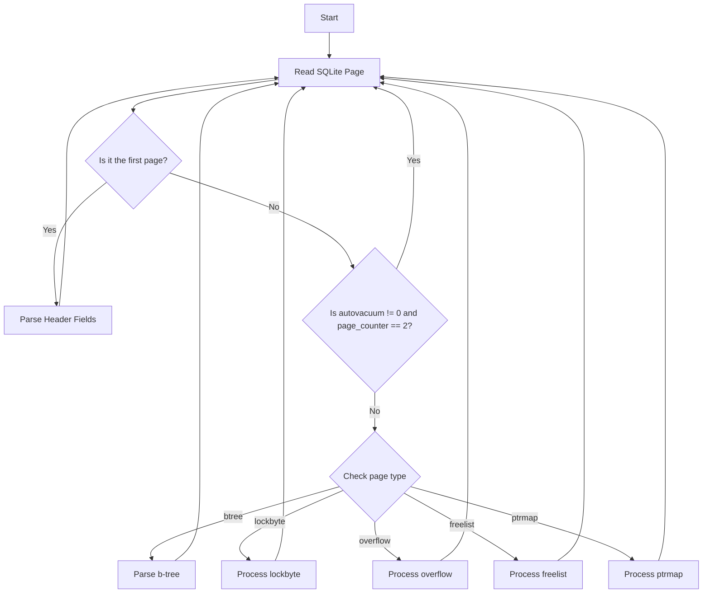

# HexMarksTheSpot: Advanced Hex File Analysis and Annotation

## Overview

HexMarksTheSpot is a Python-based application engineered to offer an intuitive yet sophisticated environment for hex-level file analysis and annotation. The platform is designed for both novice and experienced users, serving as a facilitative tool for manual file validation and educational exploration.

Example screenshot:

## Objectives

- Facilitate manual validation of files at the hex level.
- Provide an educational platform for understanding file structures and sequences.
- Enhance visual recognition of distinct data sequences.
- Encourage community contributions to expand artifact recognition capabilities.

## Features

### Core Functionalities

- **Comprehensive Parsing**: Decode and interpret file content, offering detailed information about parsed sequences.
- **Syntax Highlighting**: Utilize color-coded hex sequences and corresponding ASCII translations for easier data recognition.
- **Mirrored Behavior**: Ensure consistent user experience between hex and ASCII views.
- **Selective Parsing**: Option to halt parsing, useful when investigating specific segments of a file.
- **Searching**: Search for findings in the listview to filter down and faster compare similar values across the file. 
- **Export csv**: Based on what is left before (everything) or after a search (limited) export it out to csv. (Feature under development/improvement - might be buggy).
- **Bookmark findings**: In the current run/currently parsed file, you can bookmark your sequences for easier lookup (A bit buggy still - under development)
- **Click to go to offset**: Most of visible artefacts has the functionality of a "click to go to offset". More will come.

### Known Limitations

- Performance issues - large files may take a long time to parse. Multi-threading implemented to maintain GUI responsiveness.
- Search functionality may exhibit unexpected behavior during active parsing. Stopping the parsing before searching is recommended (I am considering to disable search while parsing).
- Limited artifact support, with ongoing development for SQLite and LNK file types.
- Loading bar is not always showing the wanted result, meaning complete is sometimes not shown as completed. (bug)

### Future Enhancements

- Plan to introduce a 'diff' feature to compare the original file against parsed segments, aiding in the identification of parsing errors or omissions.

## Contributing: Let's Build This Together

HexMarksTheSpot was born out of the need for a user-friendly, yet powerful, platform for hex-level file analysis and annotation. As we venture deeper into the realm of digital forensics, cybersecurity, and data analysis, the complexities and varieties of file formats and structures continue to grow exponentially. A single team or individual can only cover so much ground.

That's where you come in.

Your expertise and contributions can help make HexMarksTheSpot a comprehensive tool that serves a broad community of users, from students to professionals. Whether it's adding support for a new file artifact, improving parsing algorithms, or enhancing the user interface, your contributions are not just welcome—they are essential.

By pooling our collective knowledge and skills, we can transform HexMarksTheSpot into a community-driven platform that sets new standards in file analysis and annotation. If you're interested in contributing, please do so - meanwhile I'll try my best to create a contribution guide that makes sense even for beginners in python and forensics.

Let's make HexMarksTheSpot not just a tool, but a community resource.

## Workflow Diagrams

### General Workflow

### SQLite Workflow

