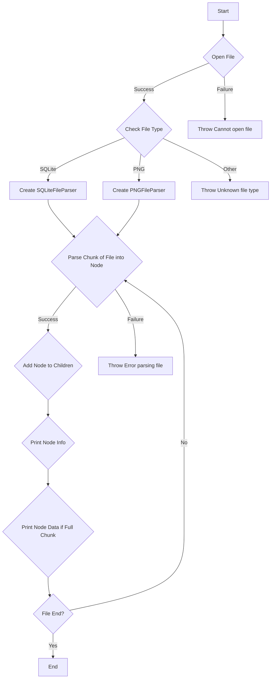
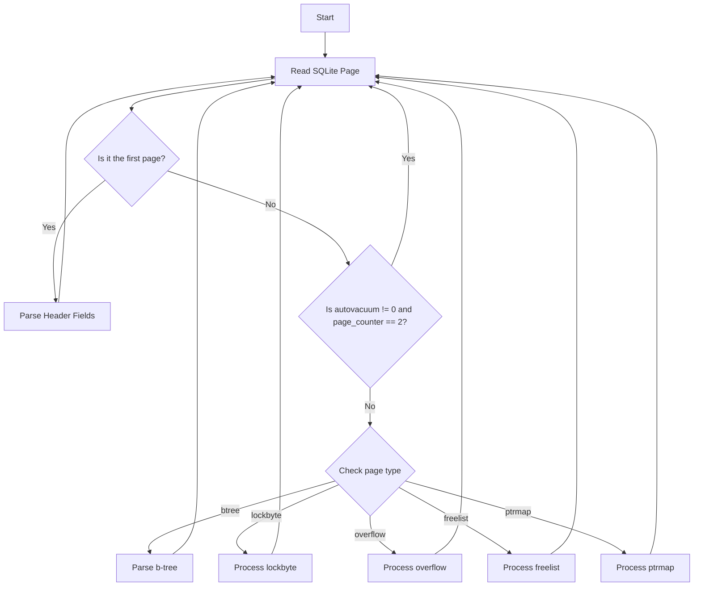

# HexMarksTheSpot: Advanced Hex File Analysis and Annotation

## Overview

HexMarksTheSpot is a Python-based application engineered to offer an intuitive yet sophisticated environment for hex-level file analysis and annotation. The platform is designed for both novice and experienced users, serving as a facilitative tool for manual file validation and educational exploration.

## Objectives

- Facilitate manual validation of files at the hex level.
- Provide an educational platform for understanding file structures and sequences.
- Enhance visual recognition of distinct data sequences.
- Encourage community contributions to expand artifact recognition capabilities.

## Features

### Core Functionalities

- **Comprehensive Parsing**: Decode and interpret file content, offering detailed information about parsed sequences.
- **Syntax Highlighting**: Utilize color-coded hex sequences and corresponding ASCII translations for easier data recognition.
- **Mirrored Behavior**: Ensure consistent user experience between hex and ASCII views.
- **Selective Parsing**: Option to halt parsing, useful when investigating specific segments of a file.
- **Searching**: Search for findings in the listview to filter down and faster compare similar values across the file.
- **Export csv**: Based on what is left before (everything) or after a search (limited) export it out to csv. (Feature under development/improvement - might be buggy).

### Known Limitations

- Performance issues - large files may take a long time to parse. Multi-threading implemented to maintain GUI responsiveness.
- Search functionality may exhibit unexpected behavior during active parsing.
- Limited artifact support, with ongoing development for SQLite and LNK file types.

### Future Enhancements

- Plan to introduce a 'diff' feature to compare the original file against parsed segments, aiding in the identification of parsing errors or omissions.

## Workflow Diagrams

### General Workflow

### SQLite Workflow

