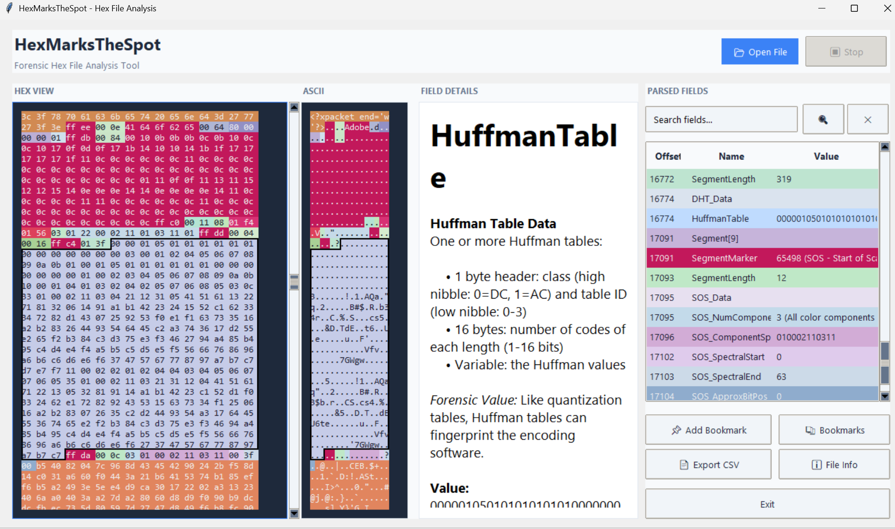
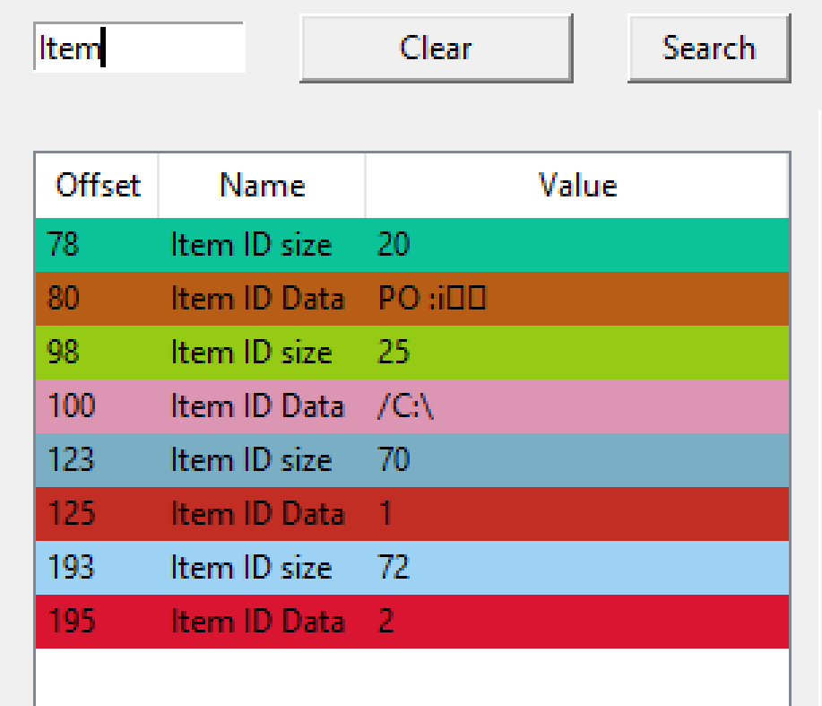
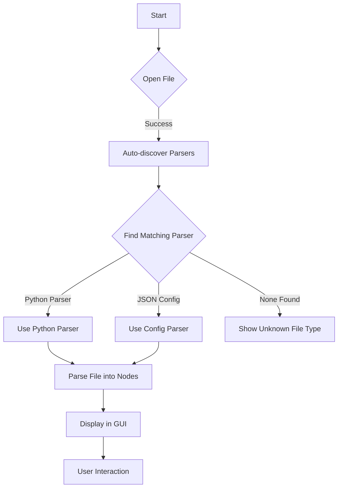
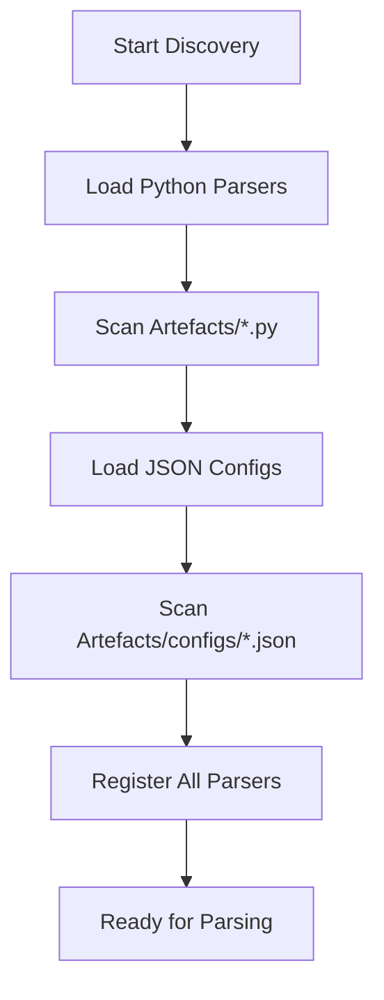

# HexMarksTheSpot: Advanced Hex File Analysis and Annotation


## Overview

HexMarksTheSpot is a Python-based application engineered to offer an intuitive yet sophisticated environment for hex-level file analysis and annotation. The platform is designed for both novice and experienced users, serving as a facilitative tool for manual file validation and educational exploration.

**Now with JSON-based parser configuration!** Forensicators can create new artifact parsers without writing Python code.

Example screenshot:


---

## Quick Start

### Installation (One-Liner)

```bash
# Clone and install
git clone https://github.com/bittib010/HexMarksTheSpot.git
cd HexMarksTheSpot
pip install -e .
```

### Run the Application

```bash
# Start the GUI
python gui.py

# Or use the command line
python main.py --cli path/to/file

# List available parsers  
python main.py --list
```

---

## Installation Guide

### Prerequisites

- Python 3.9 or higher
- pip (Python package manager)

### Option 1: Standard Installation

```bash
# 1. Clone the repository
git clone https://github.com/yourusername/HexMarksTheSpot.git
cd HexMarksTheSpot

# 2. Create a virtual environment (recommended)
python -m venv venv

# On Windows:
venv\Scripts\activate

# On macOS/Linux:
source venv/bin/activate

# 3. Install dependencies
pip install -r requirements.txt

# 4. Run the application
python gui.py
```

### Option 2: Development Installation

```bash
# Install in editable mode with dev dependencies
pip install -e ".[dev]"
```

### Option 3: Standalone Executable (Windows)

Download the latest release from the [Releases page](https://github.com/yourusername/HexMarksTheSpot/releases) - no Python installation required!

---

## Building a Standalone Executable

### Using PyInstaller

```bash
# 1. Install development dependencies
pip install -r requirements-dev.txt

# 2. Build the executable
pyinstaller --onefile --windowed --name HexMarksTheSpot --add-data "Artefacts;Artefacts" --add-data "images;images" gui.py

# The executable will be in the 'dist' folder
```

### Build Script (Windows)

Create `build.bat`:
```batch
@echo off
pip install -r requirements-dev.txt
pyinstaller --onefile --windowed --name HexMarksTheSpot --add-data "Artefacts;Artefacts" --add-data "images;images" --icon=images/icon.ico gui.py
echo Build complete! Executable is in the 'dist' folder.
pause
```

### Build Script (macOS/Linux)

Create `build.sh`:
```bash
#!/bin/bash
pip install -r requirements-dev.txt
pyinstaller --onefile --windowed --name HexMarksTheSpot --add-data "Artefacts:Artefacts" --add-data "images:images" gui.py
echo "Build complete! Executable is in the 'dist' folder."
```

---

## Creating Custom Parsers

HexMarksTheSpot supports two ways to create parsers:

### Method 1: JSON Configuration (No Programming Required!)

Create a JSON file in `Artefacts/configs/` with your file format definition:

```json
{
    "name": "MyFileFormat",
    "description": "Parser for my custom file format",
    "magic_bytes": "4D594654",
    "magic_offset": 0,
    "endianness": "little",
    "fields": [
        {
            "name": "signature",
            "size": 4,
            "type": "bytes",
            "description": "File signature"
        },
        {
            "name": "version",
            "size": 2,
            "type": "uint",
            "description": "Version number"
        },
        {
            "name": "timestamp",
            "size": 8,
            "type": "filetime",
            "description": "Creation timestamp",
            "forensic_value": true
        }
    ]
}
```

#### Supported Field Types

| Type | Description |
|------|-------------|
| `bytes` | Raw bytes (hex display) |
| `uint` | Unsigned integer |
| `int` | Signed integer |
| `string` | ASCII string |
| `utf16` / `utf16le` / `utf16be` | UTF-16 encoded string |
| `guid` | Windows GUID (16 bytes) |
| `filetime` | Windows FILETIME (8 bytes) |
| `unix_time` | Unix timestamp (4 bytes) |
| `unix_time_64` | Unix timestamp (8 bytes) |
| `bitfield` | Bit flags with named bits |
| `skip` | Skip bytes (padding) |
| `vlq` | Variable-Length Quantity (1-4 bytes, MSB continuation) |
| `remaining` | Read all remaining bytes |

#### Bitfield Example

```json
{
    "name": "flags",
    "size": 4,
    "type": "bitfield",
    "description": "File flags",
    "bit_flags": {
        "0": "ReadOnly",
        "1": "Hidden",
        "2": "System",
        "3": "Directory"
    }
}
```

#### Variable-Length Quantity (VLQ)

VLQ fields read 1-4 bytes using MSB continuation encoding (bit 7 = more bytes follow). Used in MIDI delta times, protobuf varints, and Git packfiles.

```json
{
    "name": "DeltaTime",
    "type": "vlq",
    "description": "Ticks since previous event"
}
```

**Byte-size tracking:** VLQ fields automatically store `{name}_bytes` in `parsed_values` with the number of bytes consumed. This lets subsequent fields compute remaining sizes:

```json
{ "name": "DeltaTime", "type": "vlq" },
{ "name": "RemainingData", "size": "$TotalLength - $DeltaTime_bytes", "type": "bytes" }
```

> **Note:** VLQ fields do not require a `size` property — they dynamically read bytes until the MSB continuation flag is clear.

#### Value Maps (Enums)

```json
{
    "name": "file_type",
    "size": 1,
    "type": "uint",
    "description": "Type of file",
    "value_map": {
        "0": "Unknown",
        "1": "Document",
        "2": "Image",
        "3": "Video"
    }
}
```

#### Output Format (Display Override)

By default, the Value column shows the native parsed value (e.g., a `uint` shows a decimal number). Use `output_format` to change the **display** without affecting parsing:

```json
{
    "name": "header_size",
    "size": 4,
    "type": "uint",
    "output_format": "hex",
    "description": "Always 0x4C — shown in hex for clarity"
}
```

**Key distinction:** `type` controls how bytes are **parsed**; `output_format` controls how the parsed value is **displayed**.

| Format | Example Output | Best For |
|--------|---------------|----------|
| `hex` | `0x0000004C` | Signatures, offsets, serial numbers |
| `decimal` | `16,885,952` | Counts, lengths |
| `size_bytes` | `4.0 KB` | File sizes |
| `bool` | `True` / `False` | Flags |
| `ascii` | `MZ` | Magic bytes as text |
| `base64` | `SGVsbG8...` | Binary blobs |
| `binary` | `0b10101011` | Bit patterns |
| `ip4` / `ip6` | `192.168.1.1` | Network addresses |
| `datetime_filetime` | `2023-03-15 14:30:00 UTC` | Raw FILETIME bytes |
| `datetime_unix` | `2019-01-13 08:15:32 UTC` | Raw Unix timestamp bytes |
| `datetime_unix_ms` | `2023-03-15 14:30:00.123 UTC` | Unix ms timestamps |

#### Forensic Highlighting

Mark fields with forensic significance using `forensic_value`:

```json
{
    "name": "timestamp",
    "size": 8,
    "type": "filetime",
    "description": "File creation timestamp",
    "forensic_value": "timestamp"
}
```

Available categories: `true` (default red), `"critical"`, `"important"`, `"timestamp"`, `"identifier"`, `"path"`, `"network"`. Use `"informational": true` for green/teal descriptive fields.

#### Conditional Sections

```json
{
    "name": "OptionalData",
    "type": "section",
    "condition": "$flags.0",
    "fields": [
        {"name": "extra", "size": "$extra_size", "type": "bytes"}
    ]
}
```

Conditions support bitfield access (`$flags.0`), comparisons (`$type == 5`), and boolean operators (`$a == 1 or $b == 2`).

#### Repeating Structures

```json
{
    "name": "Records",
    "type": "struct",
    "repeat": "until",
    "repeat_until": "$marker == -1",
    "fields": [
        {"name": "marker", "size": 4, "type": "int"},
        {"name": "data", "size": "$record_size", "type": "bytes", "condition": "$marker != -1"}
    ]
}
```

Repeat modes: fixed count (`"repeat": 5`), field reference (`"repeat": "$count"`), until EOF (`"repeat": "eof"`), or condition-based (`"repeat": "until"` with `"repeat_until"`).

#### Expected Values & Validation

```json
{
    "name": "page_size",
    "size": 2,
    "type": "uint",
    "expected_values": [512, 1024, 2048, 4096],
    "description": "Must be a power of 2"
}
```

Supports both lists of allowed values and `{"min": 0, "max": 255}` range constraints.

---

### Method 2: Converting 010 Editor Templates (.bt)

The `Artefacts/` directory contains `.bt` template files from the [SweetScape 010 Editor Repository](https://www.sweetscape.com/010editor/repository/templates/). These serve as reference specifications for creating JSON configs.

#### Conversion Steps

1. **Read the `.bt` file** to understand the complete binary structure
2. **Identify magic bytes** from the `ID Bytes` comment
3. **Map data types**:
   | 010 Editor | JSON Config |
   |------------|-------------|
   | `char[N]` | `"type": "string", "size": N` |
   | `short`/`ushort` | `"type": "uint", "size": 2` |
   | `int`/`uint` | `"type": "int"` or `"uint", "size": 4` |
   | `int64`/`uint64` | `"type": "uint", "size": 8` |
   | `FILETIME` | `"type": "filetime", "size": 8` |
   | `wchar_t[N]` | `"type": "utf16le", "size": "$len * 2"` |
   | `enum` (value-based) | `"value_map": {...}` |
   | `enum` (flag-based) | `"type": "bitfield", "bit_flags": {...}` |
4. **Convert conditionals**: `if (x)` → `"condition": "$x"`
5. **Convert loops**: `while`/`for` → `"repeat"` on struct/section
6. **Add forensic documentation**: Descriptions, `forensic_value` markers, `forensic_notes`
7. **Verify byte accounting**: Ensure all bytes are covered; use `"type": "skip"` for padding

See `Artefacts/configs/mft.json` and `Artefacts/configs/lnk_shell_link.json` for comprehensive conversion examples.

---

### Method 3: Python Parser

Create a Python file in `Artefacts/` following this template:

```python
from common import Node, FileParser

class MyFileParser(FileParser):
    """Parser for MyFile format."""
    
    def __init__(self, file):
        super().__init__(file)
    
    @classmethod
    def recognizes(cls, file):
        file.seek(0)
        header = file.read(4)
        return header == b'MYFT'
    
    def parse(self):
        self.file.seek(0)
        root = Node(b'', "My File Format")
        
        # Read and parse header
        header = self.file.read(4)
        root.add_child(0, Node(
            data=header,
            info="<h1>Header</h1><p>File signature</p>",
            name="Header",
            table_value="MYFT"
        ))
        
        # Continue parsing...
        return root
```

---

## Objectives

- Facilitate manual validation of files at the hex level
- Provide an educational platform for understanding file structures and sequences
- Enhance visual recognition of distinct data sequences
- Encourage community contributions to expand artifact recognition capabilities
- **Enable non-programmers to create parsers via JSON configuration**

## Features

### Core Functionalities

- **Comprehensive Parsing**: Decode and interpret file content with detailed information about each sequence
- **Dynamic Parser Discovery**: Automatically loads parsers from `Artefacts/` (Python) and `Artefacts/configs/` (JSON)
- **Syntax Highlighting**: Color-coded hex sequences and ASCII translations
- **Mirrored Behavior**: Consistent experience between hex and ASCII views
- **Selective Parsing**: Stop parsing when investigating specific segments
- **Search**: Filter findings in the listview 
- **Menu Bar**: File/Edit/View/Help menu structure for clean access to all actions
- **Export CSV**: Export parsed data to CSV format
- **Export Hex Dump**: Export file as a formatted hex dump (.txt)
- **Import Hex Text**: Import hex text in multiple formats and parse it
- **Bookmarks**: Mark sequences with parsed values and comments, persist per-file, export as JSON/CSV/Markdown reports
- **File Info**: SHA-256 hash, size, field count in a modal overlay
- **Offset Format Toggle**: Switch between hex and decimal offsets live
- **Caching**: SHA-256-keyed pickle caching for fast reload of previously parsed files
- **Copy Operations**: Copy selected field as hex, decimal, ASCII, or parsed value (keyboard shortcuts)
- **Right-Click Context Menu**: Quick access to copy and bookmark actions

### Included Parsers

**Python Parsers:**
- SQLite database files
- JPEG/JPG images  
- NTFS MFT records
- Windows LNK shortcuts

**JSON Config Parsers:**
- NTFS MFT records (migrated from .bt)
- NTFS Boot Sector
- MIDI audio files (migrated from .bt)
- PNG images
- Windows Prefetch files (enhanced from .bt — all versions XP through Win11, full metrics/chains/volume parsing)
- PE executables (EXE/DLL)
- ZIP archives
- PDF documents (enhanced from .bt with forensic keyword reference)
- Windows Event Log (EVTX)
- ELF executables
- WAV audio files
- Windows Registry hives
- SQLite databases (JSON config)

### Known Limitations

- Large files may take time to parse (multi-threading maintains GUI responsiveness)
- Search during active parsing may have unexpected behavior
- Some artifact support is still in development

### Future Enhancements

- 'Diff' feature to compare original file against parsed segments
- More built-in parsers
- Plugin marketplace

---

## Project Structure

```
HexMarksTheSpot/
├── gui.py                 # Main GUI application
├── main.py                # CLI and entry point
├── common.py              # Core Node and FileParser classes
├── config_parser.py       # JSON-based parser engine
├── cache_manager.py       # SHA-256 caching, bookmark persistence, export
├── parser_loader.py       # Dynamic parser discovery
├── pyproject.toml         # Modern Python packaging
├── requirements.txt       # Dependencies
├── requirements-dev.txt   # Development dependencies
├── Artefacts/
│   ├── *.bt               # 010 Editor templates (conversion reference)
│   └── configs/           # JSON parser definitions
│       ├── parser-config.schema.json  # JSON schema for validation
│       ├── _template.json             # Starter template
│       ├── mft.json                   # NTFS MFT records
│       ├── lnk_shell_link.json        # Windows LNK shortcuts
│       ├── sqlite.json                # SQLite databases
│       ├── evtx.json                  # Windows Event Log
│       ├── prefetch.json              # Windows Prefetch
│       ├── pe_exe.json                # PE executables
│       ├── ntfs_boot.json             # NTFS Boot Sector
│       ├── png.json                   # PNG images
│       ├── midi.json                  # MIDI audio files
│       ├── jpeg.json                  # JPEG images
│       ├── pdf.json                   # PDF documents
│       └── zip.json                   # ZIP archives
├── images/
└── TestFiles/
```

---

## Contributing

HexMarksTheSpot was built for the digital forensics community. Your contributions help make it better!

### Ways to Contribute

1. **Add JSON Parsers**: No programming required! Create a JSON config for a new file format
2. **Add Python Parsers**: For complex formats that need custom logic
3. **Improve Documentation**: Help others understand file formats
4. **Report Issues**: Found a bug or parsing error? Let us know!
5. **Suggest Features**: Ideas for improvements are welcome

See [CONTRIBUTION.md](CONTRIBUTION.md) for detailed guidelines.

---

## Workflow Diagrams

### General Workflow


```mermaid
graph TD
  A[Start] --> B{Open File}
  B --> |Success| C[Auto-discover Parsers]
  C --> D{Find Matching Parser}
  D --> |Python Parser| E[Use Python Parser]
  D --> |JSON Config| F[Use Config Parser]
  D --> |None Found| G[Show Unknown File Type]
  E --> H[Parse File into Nodes]
  F --> H
  H --> I[Display in GUI]
  I --> J[User Interaction]
```

### Parser Discovery


```mermaid
graph TD
  A[Start Discovery] --> B[Load Python Parsers]
  B --> C[Scan Artefacts/*.py]
  C --> D[Load JSON Configs]
  D --> E[Scan Artefacts/configs/*.json]
  E --> F[Register All Parsers]
  F --> G[Ready for Parsing]
```

---

## License

MIT License - See LICENSE file for details.

## Acknowledgments

- All contributors and the digital forensics community
- Documentation and specification authors for various file formats
    
    G --> B;
    H --> B;
    I --> B;
    J --> B;
    K --> B;
```
