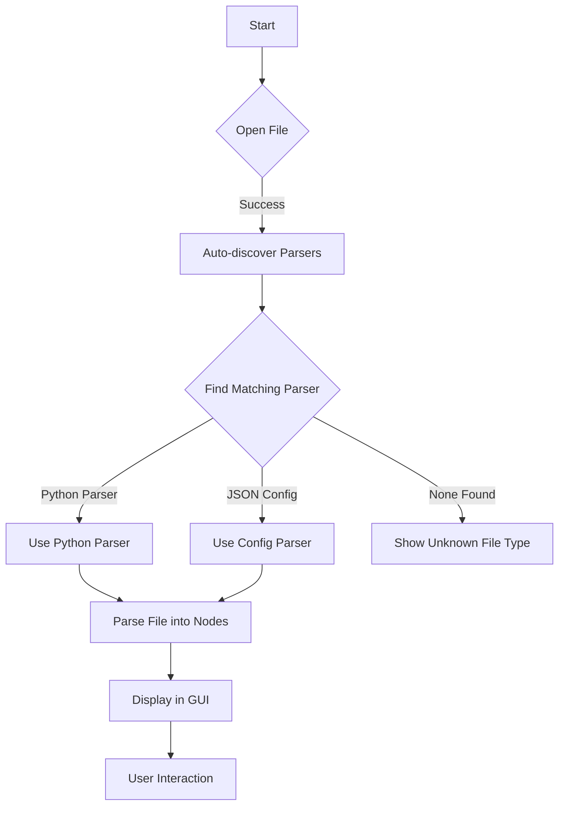
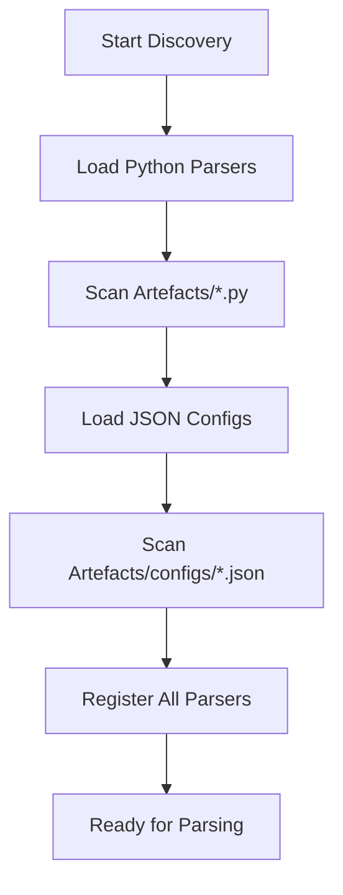

# HexMarksTheSpot: Advanced Hex File Analysis and Annotation


## Overview

HexMarksTheSpot is a Python-based application engineered to offer an intuitive yet sophisticated environment for hex-level file analysis and annotation. The platform is designed for both novice and experienced users, serving as a facilitative tool for manual file validation and educational exploration.

**Now with JSON-based parser configuration!** Forensicators can create new artifact parsers without writing Python code.

Example screenshot:


---

## Quick Start

### Installation (One-Liner)

```bash
# Clone and install
git clone https://github.com/bittib010/HexMarksTheSpot.git
cd HexMarksTheSpot
pip install -e .
```

### Run the Application

```bash
# Start the GUI
python gui.py

# Or use the command line
python main.py --cli path/to/file

# List available parsers  
python main.py --list
```

---

## Installation Guide

### Prerequisites

- Python 3.9 or higher
- pip (Python package manager)

### Option 1: Standard Installation

```bash
# 1. Clone the repository
git clone https://github.com/yourusername/HexMarksTheSpot.git
cd HexMarksTheSpot

# 2. Create a virtual environment (recommended)
python -m venv venv

# On Windows:
venv\Scripts\activate

# On macOS/Linux:
source venv/bin/activate

# 3. Install dependencies
pip install -r requirements.txt

# 4. Run the application
python gui.py
```

### Option 2: Development Installation

```bash
# Install in editable mode with dev dependencies
pip install -e ".[dev]"
```

### Option 3: Standalone Executable (Windows)

Download the latest release from the [Releases page](https://github.com/yourusername/HexMarksTheSpot/releases) - no Python installation required!

---

## Building a Standalone Executable

### Using PyInstaller

```bash
# 1. Install development dependencies
pip install -r requirements-dev.txt

# 2. Build the executable
pyinstaller --onefile --windowed --name HexMarksTheSpot --add-data "Artefacts;Artefacts" --add-data "images;images" gui.py

# The executable will be in the 'dist' folder
```

### Build Script (Windows)

Create `build.bat`:
```batch
@echo off
pip install -r requirements-dev.txt
pyinstaller --onefile --windowed --name HexMarksTheSpot --add-data "Artefacts;Artefacts" --add-data "images;images" --icon=images/icon.ico gui.py
echo Build complete! Executable is in the 'dist' folder.
pause
```

### Build Script (macOS/Linux)

Create `build.sh`:
```bash
#!/bin/bash
pip install -r requirements-dev.txt
pyinstaller --onefile --windowed --name HexMarksTheSpot --add-data "Artefacts:Artefacts" --add-data "images:images" gui.py
echo "Build complete! Executable is in the 'dist' folder."
```

---

## Creating Custom Parsers

HexMarksTheSpot supports two ways to create parsers:

### Method 1: JSON Configuration (No Programming Required!)

Create a JSON file in `Artefacts/configs/` with your file format definition:

```json
{
    "name": "MyFileFormat",
    "description": "Parser for my custom file format",
    "magic_bytes": "4D594654",
    "magic_offset": 0,
    "endianness": "little",
    "fields": [
        {
            "name": "signature",
            "size": 4,
            "type": "bytes",
            "description": "File signature"
        },
        {
            "name": "version",
            "size": 2,
            "type": "uint",
            "description": "Version number"
        },
        {
            "name": "timestamp",
            "size": 8,
            "type": "filetime",
            "description": "Creation timestamp",
            "forensic_value": true
        }
    ]
}
```

#### Supported Field Types

| Type | Description |
|------|-------------|
| `bytes` | Raw bytes (hex display) |
| `uint` | Unsigned integer |
| `int` | Signed integer |
| `string` | ASCII string |
| `utf16` / `utf16le` / `utf16be` | UTF-16 encoded string |
| `guid` | Windows GUID (16 bytes) |
| `filetime` | Windows FILETIME (8 bytes) |
| `unix_time` | Unix timestamp (4 bytes) |
| `unix_time_64` | Unix timestamp (8 bytes) |
| `bitfield` | Bit flags with named bits |
| `skip` | Skip bytes (padding) |
| `remaining` | Read all remaining bytes |

#### Bitfield Example

```json
{
    "name": "flags",
    "size": 4,
    "type": "bitfield",
    "description": "File flags",
    "bit_flags": {
        "0": "ReadOnly",
        "1": "Hidden",
        "2": "System",
        "3": "Directory"
    }
}
```

#### Value Maps (Enums)

```json
{
    "name": "file_type",
    "size": 1,
    "type": "uint",
    "description": "Type of file",
    "value_map": {
        "0": "Unknown",
        "1": "Document",
        "2": "Image",
        "3": "Video"
    }
}
```

### Method 2: Python Parser

Create a Python file in `Artefacts/` following this template:

```python
from common import Node, FileParser

class MyFileParser(FileParser):
    """Parser for MyFile format."""
    
    def __init__(self, file):
        super().__init__(file)
    
    @classmethod
    def recognizes(cls, file):
        file.seek(0)
        header = file.read(4)
        return header == b'MYFT'
    
    def parse(self):
        self.file.seek(0)
        root = Node(b'', "My File Format")
        
        # Read and parse header
        header = self.file.read(4)
        root.add_child(0, Node(
            data=header,
            info="<h1>Header</h1><p>File signature</p>",
            name="Header",
            table_value="MYFT"
        ))
        
        # Continue parsing...
        return root
```

---

## Objectives

- Facilitate manual validation of files at the hex level
- Provide an educational platform for understanding file structures and sequences
- Enhance visual recognition of distinct data sequences
- Encourage community contributions to expand artifact recognition capabilities
- **Enable non-programmers to create parsers via JSON configuration**

## Features

### Core Functionalities

- **Comprehensive Parsing**: Decode and interpret file content with detailed information about each sequence
- **Dynamic Parser Discovery**: Automatically loads parsers from `Artefacts/` (Python) and `Artefacts/configs/` (JSON)
- **Syntax Highlighting**: Color-coded hex sequences and ASCII translations
- **Mirrored Behavior**: Consistent experience between hex and ASCII views
- **Selective Parsing**: Stop parsing when investigating specific segments
- **Search**: Filter findings in the listview 
- **Export CSV**: Export parsed data to CSV format
- **Bookmarks**: Mark sequences for easier lookup

### Included Parsers

**Python Parsers:**
- SQLite database files
- JPEG/JPG images  
- NTFS MFT records
- Windows LNK shortcuts

**JSON Config Parsers:**
- PNG images
- Windows Prefetch files
- PE executables (EXE/DLL)
- ZIP archives
- PDF documents
- Windows Event Log (EVTX)

### Known Limitations

- Large files may take time to parse (multi-threading maintains GUI responsiveness)
- Search during active parsing may have unexpected behavior
- Some artifact support is still in development

### Future Enhancements

- 'Diff' feature to compare original file against parsed segments
- More built-in parsers
- Plugin marketplace

---

## Project Structure

```
HexMarksTheSpot/
├── gui.py                 # Main GUI application
├── main.py                # CLI and entry point
├── common.py              # Core Node and FileParser classes
├── config_parser.py       # JSON-based parser engine
├── parser_loader.py       # Dynamic parser discovery
├── pyproject.toml         # Modern Python packaging
├── requirements.txt       # Dependencies
├── requirements-dev.txt   # Development dependencies
├── Artefacts/
│   └── configs/           # JSON parser definitions
│       ├── jpeg.json
│       ├── lnk_shell_link.json
│       ├── sqlite.json
│       ├── ntfs_boot.json
│       ├── png.json
│       ├── prefetch.json
│       ├── pe_exe.json
│       ├── zip.json
│       ├── pdf.json
│       └── evtx.json
├── images/
└── TestFiles/
```

---

## Contributing

HexMarksTheSpot was built for the digital forensics community. Your contributions help make it better!

### Ways to Contribute

1. **Add JSON Parsers**: No programming required! Create a JSON config for a new file format
2. **Add Python Parsers**: For complex formats that need custom logic
3. **Improve Documentation**: Help others understand file formats
4. **Report Issues**: Found a bug or parsing error? Let us know!
5. **Suggest Features**: Ideas for improvements are welcome

See [CONTRIBUTION.md](CONTRIBUTION.md) for detailed guidelines.

---

## Workflow Diagrams

### General Workflow


```mermaid
graph TD
  A[Start] --> B{Open File}
  B --> |Success| C[Auto-discover Parsers]
  C --> D{Find Matching Parser}
  D --> |Python Parser| E[Use Python Parser]
  D --> |JSON Config| F[Use Config Parser]
  D --> |None Found| G[Show Unknown File Type]
  E --> H[Parse File into Nodes]
  F --> H
  H --> I[Display in GUI]
  I --> J[User Interaction]
```

### Parser Discovery


```mermaid
graph TD
  A[Start Discovery] --> B[Load Python Parsers]
  B --> C[Scan Artefacts/*.py]
  C --> D[Load JSON Configs]
  D --> E[Scan Artefacts/configs/*.json]
  E --> F[Register All Parsers]
  F --> G[Ready for Parsing]
```

---

## License

MIT License - See LICENSE file for details.

## Acknowledgments

- All contributors and the digital forensics community
- Documentation and specification authors for various file formats
    
    G --> B;
    H --> B;
    I --> B;
    J --> B;
    K --> B;
```
